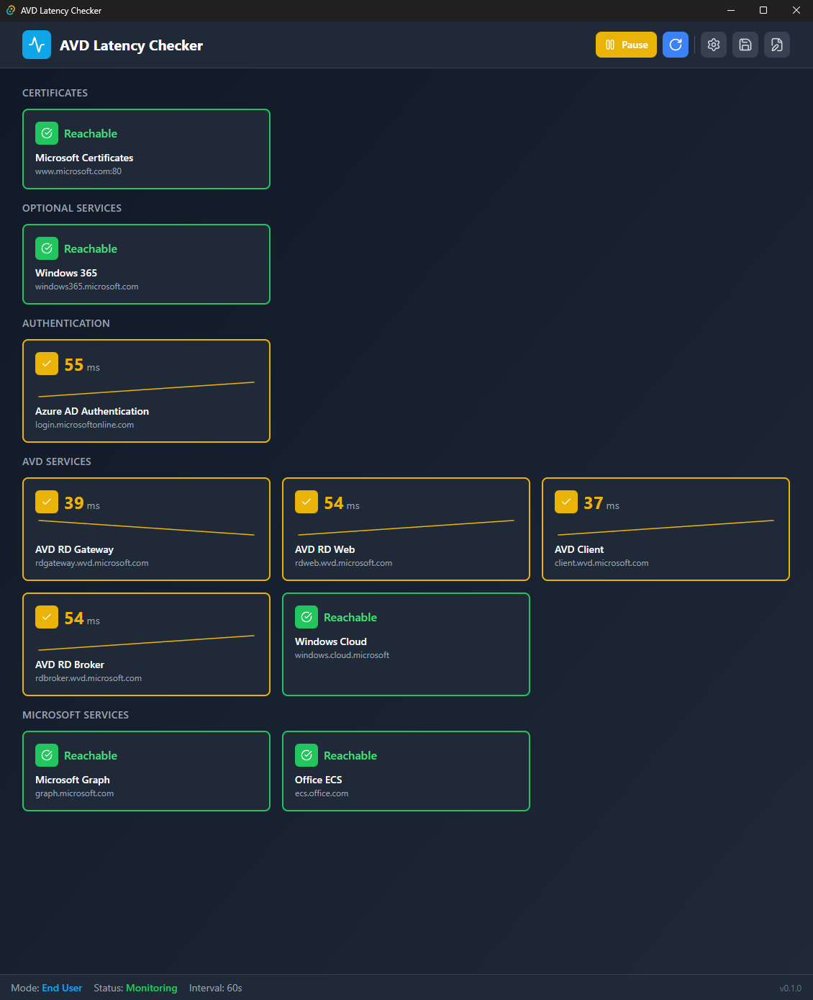
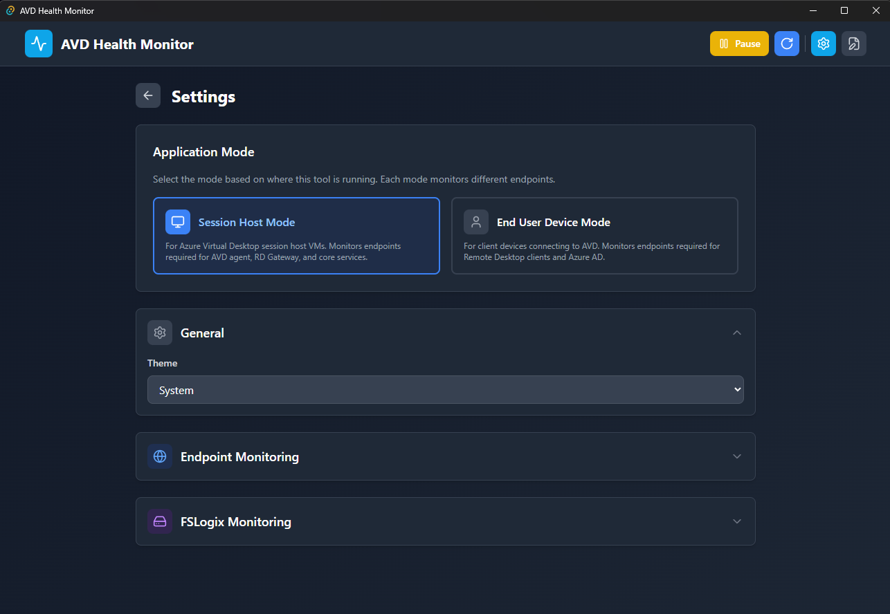
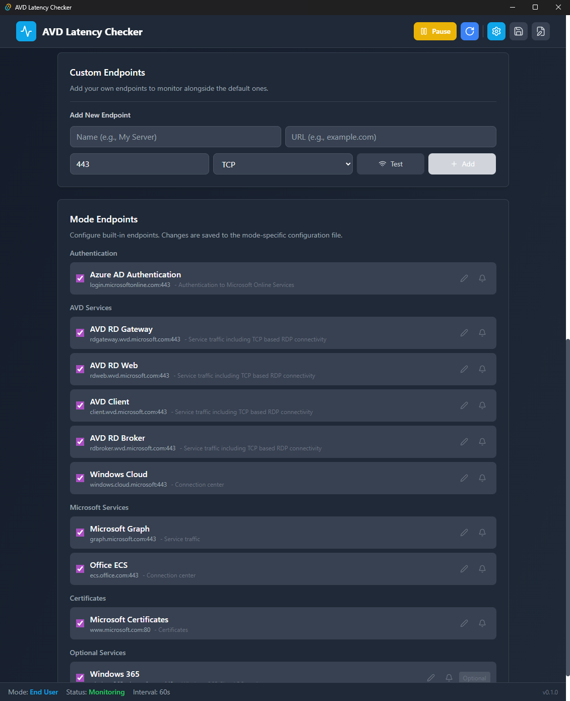
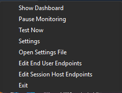
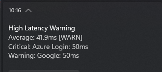
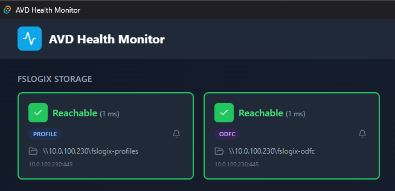
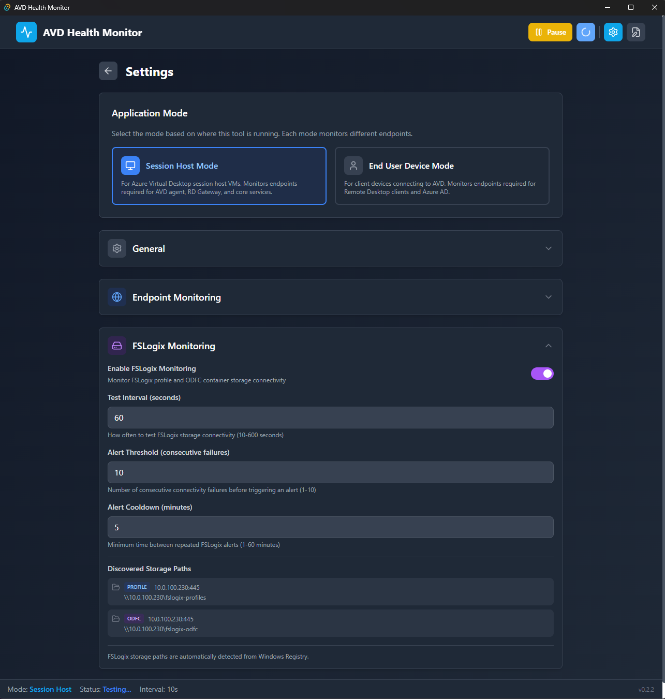

# AVD Health Monitor

A modern Windows system tray application for real-time Azure Virtual Desktop (AVD) endpoint health monitoring.

[](https://github.com/seb07-cloud/avd-health-monitor)
[](https://github.com/seb07-cloud/avd-health-monitor/actions)
[](https://github.com/seb07-cloud/avd-health-monitor/releases)
[](LICENSE)

---

## Screenshots

### Main Dashboard
Real-time endpoint monitoring with latency graphs, statistics, and enable/disable toggles.



### Settings Panel
Configure application mode, thresholds, notifications, and manage endpoints.

#### General Settings



#### Endpoint Monitoring - Settings



### System Tray
Dynamic color-coded tray icon shows current status at a glance. Right-click for quick actions.



### Windows Toast Notifications
Consolidated alerts with details for all affected endpoints.



### FSLogix Storage Monitoring (Session Host Mode)
Real-time connectivity monitoring for FSLogix profile and ODFC storage paths.



#### FSLogix Monitoring - Settings
Configure FSLogix-specific test intervals, alert thresholds, and mute individual paths.



---

## Features

### Two Application Modes

The application supports two distinct monitoring modes with pre-configured endpoints based on Microsoft's official AVD documentation:

**Session Host Mode**
- For Azure Virtual Desktop session host VMs
- Monitors endpoints required for AVD agent, RD Gateway, Windows activation, and core services
- Includes wildcard domain expansion (e.g., `*.wvd.microsoft.com` expands to rdgateway, rdweb, client, rdbroker)
- **FSLogix Storage Monitoring** - Automatically detects and monitors FSLogix profile/ODFC storage paths

**End User Device Mode**
- For client devices connecting to AVD (Windows, macOS, iOS, Android, Web)
- Monitors endpoints required for Remote Desktop clients, Azure AD authentication, and Microsoft services

Switching modes automatically loads the appropriate endpoints and triggers a connectivity test.

### Core Functionality
- **Real-time Latency Monitoring** - TCP, HTTP/HTTPS testing with configurable intervals (5-300 seconds)
- **Comprehensive AVD Endpoints** - Pre-configured endpoints from Microsoft's official documentation
- **Custom Endpoints** - Add your own endpoints to monitor alongside defaults
- **Enable/Disable/Mute Endpoints** - Toggle monitoring or mute alerts for individual endpoints
- **Live Graphs** - Interactive sparkline charts with configurable time range (1-24 hours)
- **Statistics** - Min/Max/Average latency per endpoint
- **History Persistence** - Latency data persisted to localStorage (survives app restarts, 24h retention)

### User Interface
- **Modern Windows 11 Design** - Clean, professional interface
- **Dark/Light Themes** - Automatic system theme detection or manual selection
- **Dynamic Tray Icon** - Color-coded status indicator
- **Tray Menu Actions** - Quick access to Settings, Test Now, Pause/Resume, and Exit
- **Real-time Dashboard** - Cards with live latency updates and graphs
- **Interactive Tooltips** - Hover over graph points to see exact values and timestamps

### Notifications & Alerts
- **Smart Notifications** - Windows toast alerts when latency exceeds thresholds
- **Configurable Thresholds** - Set your own excellent/good/warning/critical levels
- **Consecutive Check Threshold** - Only alert after N consecutive high latency checks (default: 3)
- **Alert Cooldown** - Configurable cooldown period between repeated alerts (1-60 minutes)
- **Mute Individual Endpoints** - Suppress alerts for specific endpoints without disabling monitoring
- **Consolidated Alerts** - Multiple endpoint issues combined into single notification
- **Visual Feedback** - Tray icon changes color based on worst endpoint status

### FSLogix Storage Monitoring (Session Host Only)
- **Automatic Detection** - Reads FSLogix profile and ODFC container paths from Windows Registry
- **Real-time Connectivity** - Tests SMB connectivity to storage endpoints (port 445)
- **Separate Test Interval** - Configure FSLogix test frequency independently from endpoint tests (default: 60 seconds)
- **Consecutive Failure Alerts** - Only alert after N consecutive failures (default: 3)
- **Mute Individual Paths** - Suppress alerts for specific storage paths without disabling monitoring
- **Visual Status** - Green/red indicators show reachable/unreachable status with latency

### Configuration
- **Separate Endpoint Files** - Mode-specific JSON configuration files for session host and end user endpoints
- **Editable Configuration** - All settings stored in editable JSON files
- **Auto-save** - Configuration changes automatically saved
- **Open in Editor** - Quick access to edit settings files directly
- **Auto-start** - Launch automatically on Windows boot

---

## Installation

### Windows Installer (Recommended)

1. Download the latest MSI installer from [Releases](https://github.com/seb07-cloud/avd-health-monitor/releases)
2. Run `AVD-Latency-Checker-<version>-x64-setup.msi`
3. Follow the installation wizard
4. Launch from Start Menu or Desktop shortcut

### Portable Version

1. Download `AVD-Latency-Checker-<version>-x64-portable.exe` from [Releases](https://github.com/seb07-cloud/avd-health-monitor/releases)
2. Place anywhere (e.g., `C:\Tools\AVDLatencyChecker`)
3. Run the executable - no installation required

### System Requirements

- **OS:** Windows 10 (1809+) or Windows 11
- **Runtime:** WebView2 (pre-installed on Windows 11, auto-installs on Windows 10)
- **RAM:** ~50MB
- **Disk:** ~15MB installed
- **Network:** Internet access to test AVD endpoints

---

## Usage Guide

### First Launch

1. **App starts minimized to system tray** (look for colored icon)
2. **Click the tray icon** to open dashboard
3. **Default mode is Session Host** - switch to End User Device in Settings if needed
4. **Tray icon color** shows current status:
   - **Green** = Excellent (<50ms default)
   - **Yellow** = Good (50-100ms default)
   - **Orange** = Warning (100-150ms default)
   - **Red** = Critical (>150ms default)

### Switching Modes

1. Open dashboard → Click **Settings** (gear icon)
2. Under **Application Mode**, select either:
   - **Session Host** - For AVD session host VMs
   - **End User Device** - For client devices
3. Endpoints will reload and a test will run automatically

### Adding Custom Endpoints

1. Open **Settings**
2. Scroll to **Custom Endpoints** section
3. Enter **Name** (e.g., "My Gateway")
4. Enter **URL** (e.g., `mygateway.example.com`)
5. Set **Port** and **Protocol** (TCP/HTTP/HTTPS)
6. Click **Test** to verify connectivity
7. Click **Add** to save

### Configuring Thresholds

1. Open **Settings**
2. Find **Latency Thresholds** section
3. Adjust values with visual scale preview:
   - **Excellent:** Default 50ms
   - **Good:** Default 100ms
   - **Warning:** Default 150ms
   - **Critical:** Automatically >150ms

### Tray Menu Actions

Right-click the tray icon for quick actions:
- **Show Dashboard** - Open the main window
- **Pause/Resume Monitoring** - Temporarily stop/start tests
- **Test Now** - Force immediate latency test
- **Settings** - Open settings panel
- **Open Settings File** - Edit JSON configuration directly
- **Exit** - Close the application

### Viewing Logs

Logs are stored in:
```
%APPDATA%\AVDHealthMonitor\logs\
```

Example log file: `avd_latency_2026-01-04.log`

Format (JSON Lines):
```json
{"timestamp":"2026-01-04T15:30:45+00:00","endpoint":"rdgateway.wvd.microsoft.com","latency_ms":25.4,"status":"excellent"}
```

---

## Configuration

### Default Settings

| Setting | Default | Description |
|---------|---------|-------------|
| Test Interval | 10 seconds | How often to test endpoints |
| Theme | System | Light/Dark/System auto-detect |
| Notifications | Enabled | Windows toast alerts |
| Alert Threshold | 3 checks | Consecutive failures before alert |
| Alert Cooldown | 5 minutes | Minimum time between alerts |
| Graph Time Range | 1 hour | History shown in graphs |
| FSLogix Enabled | Yes | Enable FSLogix storage monitoring (Session Host only) |
| FSLogix Test Interval | 60 seconds | How often to test FSLogix storage paths |
| FSLogix Alert Threshold | 3 checks | Consecutive failures before FSLogix alert |
| FSLogix Alert Cooldown | 5 minutes | Minimum time between FSLogix alerts |

### Latency Thresholds

| Status | Range | Color |
|--------|-------|-------|
| Excellent | 0-50ms | Green |
| Good | 51-100ms | Yellow |
| Warning | 101-150ms | Orange |
| Critical | >150ms | Red |

### Configuration Files

**Main Settings:**
```
%APPDATA%\AVDHealthMonitor\settings.json
```

**Session Host Endpoints:**
```
%APPDATA%\AVDHealthMonitor\sessionhost-endpoints.json
```

**End User Endpoints:**
```
%APPDATA%\AVDHealthMonitor\enduser-endpoints.json
```

### Session Host Endpoints (Default)

| Endpoint | URL | Port | Purpose |
|----------|-----|------|---------|
| Azure AD Authentication | login.microsoftonline.com | 443 | Authentication |
| AVD Services (wildcard) | *.wvd.microsoft.com | 443 | RD Gateway, Web, Client, Broker |
| Windows Cloud Service | global.prod.service.windows.cloud.microsoft.com | 443 | Service Traffic |
| Azure Marketplace | catalogartifact.azureedge.net | 443 | Marketplace |
| Agent Updates | mrsglobalsteus2prod.blob.core.windows.net | 443 | Agent/SXS updates |
| Azure Portal Support | wvdportalstorageblob.blob.core.windows.net | 443 | Portal support |
| Azure Monitor | gcs.prod.monitoring.core.windows.net | 443 | Monitoring |
| Windows KMS | azkms.core.windows.net | 1688 | Windows activation |
| OCSP Certificates | oneocsp.microsoft.com | 80 | Certificate validation |
| Certificate Trust List | ctldl.windowsupdate.com | 80 | Certificate validation |

### End User Endpoints (Default)

| Endpoint | URL | Port | Purpose |
|----------|-----|------|---------|
| Azure AD Authentication | login.microsoftonline.com | 443 | Authentication |
| AVD RD Gateway | rdgateway.wvd.microsoft.com | 443 | RDP connectivity |
| AVD RD Web | rdweb.wvd.microsoft.com | 443 | Web access |
| AVD Client | client.wvd.microsoft.com | 443 | Client service |
| AVD RD Broker | rdbroker.wvd.microsoft.com | 443 | Connection broker |
| Windows Cloud | windows.cloud.microsoft | 443 | Connection center |
| Microsoft Graph | graph.microsoft.com | 443 | Service traffic |
| Office ECS | ecs.office.com | 443 | Connection center |

---

## Architecture

### Tech Stack

**Frontend:**
- React 18 + TypeScript 5
- TailwindCSS 3
- Recharts (graphs)
- Zustand (state management)

**Backend:**
- Tauri 2 (desktop framework)
- Rust (system integration)
- Tokio (async runtime)
- reqwest (HTTP client)

### Project Structure

```
avd-health-monitor/
├── src/                          # Frontend (React + TypeScript)
│   ├── components/
│   │   ├── Dashboard.tsx         # Main monitoring view
│   │   ├── EndpointCard.tsx      # Individual endpoint display
│   │   ├── FSLogixSection.tsx    # FSLogix storage monitoring
│   │   └── SettingsPanel.tsx     # Configuration UI
│   ├── hooks/
│   │   ├── useTrayIcon.ts        # Tray icon + notifications
│   │   └── useSettingsSync.ts    # Settings file synchronization
│   ├── store/
│   │   └── useAppStore.ts        # Global state (Zustand)
│   ├── services/
│   │   └── latencyService.ts     # Latency testing service
│   └── types.ts                  # TypeScript definitions
│
├── src-tauri/                    # Backend (Rust)
│   ├── src/
│   │   ├── lib.rs                # Main Tauri app + commands
│   │   ├── latency.rs            # TCP/HTTP latency testing
│   │   ├── settings.rs           # Settings + endpoint file management
│   │   ├── tray_icon.rs          # Dynamic icon generation
│   │   ├── logger.rs             # File logging
│   │   ├── autostart.rs          # Windows Registry auto-start
│   │   └── fslogix.rs            # FSLogix registry detection
│   ├── resources/
│   │   ├── settings.json         # Default settings
│   │   ├── sessionhost-endpoints.json
│   │   └── enduser-endpoints.json
│   └── tauri.conf.json           # Tauri configuration
│
└── .github/workflows/            # CI/CD
    ├── ci.yml                    # Build & test
    └── release.yml               # Automated releases
```

---

## Development

### Prerequisites

- **Node.js** 22+
- **pnpm** 10+
- **Rust** 1.75+ (stable)
- **Visual Studio Build Tools** (Windows)

### Setup Development Environment

```powershell
# Clone repository
git clone https://github.com/seb07-cloud/avd-health-monitor.git
cd avd-health-monitor

# Install dependencies
pnpm install

# Run in development mode
pnpm tauri dev
```

### Build for Production

```powershell
# Build Windows MSI + EXE
pnpm tauri build

# Output:
# src-tauri/target/release/bundle/msi/*.msi
# src-tauri/target/release/avd-health-monitor.exe
```

### Run Tests

```powershell
# Frontend tests
pnpm test:run

# Rust tests
cd src-tauri && cargo test

# Type checking
pnpm exec tsc --noEmit
```

---

## Troubleshooting

### App won't start
- Ensure WebView2 is installed
- Check Windows Event Viewer for errors
- Try running as Administrator

### No latency data showing
- Verify internet connectivity
- Check Windows Firewall isn't blocking the app
- Ensure AVD endpoints are accessible from your network

### Endpoint shows error but manual test works
- Some endpoints (like `www.msftconnecttest.com`) only respond on specific ports
- Check the endpoint configuration matches the expected port/protocol
- HTTP endpoints (port 80) require `http` protocol, not `tcp`

### Tray icon not visible
- Check Windows system tray overflow area
- Right-click taskbar → Taskbar settings → Enable the app icon

### Mode switch doesn't trigger test
- Ensure you're clicking the mode button, not just hovering
- Check browser console for errors (F12 in dev mode)

### FSLogix paths not showing
- FSLogix monitoring only works in **Session Host Mode**
- Ensure FSLogix is installed and configured on the VM
- Check that FSLogix registry keys exist: `HKLM\SOFTWARE\FSLogix\Profiles` or `HKLM\SOFTWARE\Policies\FSLogix\ODFC`
- Verify VHDLocations or CCDLocations registry values are set

### FSLogix shows unreachable but storage works
- The app tests SMB connectivity on port 445
- Ensure SMB traffic is allowed through any firewalls
- Check that the storage account allows SMB connections from the VM
- Private endpoints may require specific DNS configuration

---

## Contributing

Contributions are welcome! Please:

1. Fork the repository
2. Create a feature branch (`git checkout -b feature/amazing-feature`)
3. Commit your changes (`git commit -m 'Add amazing feature'`)
4. Push to branch (`git push origin feature/amazing-feature`)
5. Open a Pull Request

---

## License

This project is licensed under the MIT License - see [LICENSE](LICENSE) file for details.

---

## Acknowledgments

- Built with [Tauri](https://tauri.app/)
- Icons from [Lucide](https://lucide.dev/)
- Charts by [Recharts](https://recharts.org/)
- Endpoint documentation from [Microsoft Learn](https://learn.microsoft.com/en-us/azure/virtual-desktop/required-fqdn-endpoint)

---

<div align="center">

**Made for the AVD Community**

[Report Bug](https://github.com/seb07-cloud/avd-health-monitor/issues) | [Request Feature](https://github.com/seb07-cloud/avd-health-monitor/issues)

</div>
